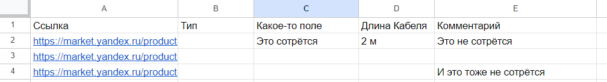
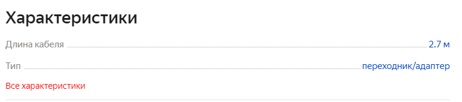
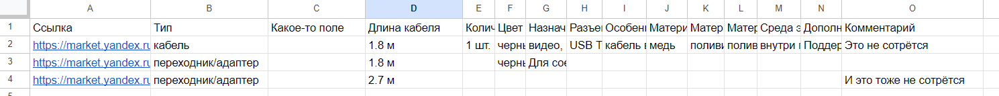

# Updater tool

Тестовое задание для компании **Viarmo** 
от Елизаветы Шалаевой (eliz.shalaeva@gmail.com)  

### Contents:

 - [Подготовка перед запуском](#Подготовка-перед-запуском)
   - [Подготовка гугл таблицы](#Подготовка-гугл-таблицы)
   - [Заполнение конфиг файла](#Заполнение-конфиг-файла)
 - [Запуск программы](#Запуск-программы)
-  [Что можно улучшить в существующем решении](#Что-можно-улучшить-в-существующем-решении)


## Подготовка перед запуском
Для корректного запуска необходимо заполнить гугл-таблицу, получить кред-файл от сервис аккаунта гугла
для доступа к таблице, а также в соответствии с таблицей настроить конфиг файл. 

### Подготовка гугл таблицы 
Таблица должна быть формата, как показано на рисунке:


Есть колонка со ссылками (в данном случае она называется "Ссылка"), остальные колонки могут быть произвольными.


Ссылки на Яндекс Маркет следует вставлять те, куда ведёт клик "Все характеристики" при просмотре страницы соответствующего товара 


Также следует создать Service Account в рамках Google API, инструкция как сделать сервис аккаунт и получить конфиг в формате json 
[тут](https://developers.google.com/workspace/guides/get-started).


### Заполнение конфиг файла

[Конфиг файл](config/config.toml) в формате toml содержит несколько полей, все из которых обязательны к заполнению:

- **spreadsheet_link** - ссылка на таблицу
- **link_field** - название колонки, содержащей ссылки на товары в яндекс-маркете
- **reserved_fields** - названия колонок, значения которых нужно сохранить после слияния со свежими данными (например столбец с комментариями и т п)
- **service_account_creds_file** - относительный или абсолютный путь до файла с информацией Service Account-а Google в формате json (см. предыдущий раздел).

## Запуск программы

Запуск программы желательно осуществлять из под докера.


````
sudo docker build -t ya-updater-shalaeva:latest .

sudo docker run \
    -v /путь до папки с конфигом:/config \
    -v /путь до папки с логами:/logs \
    ya-updater-shalaeva:latest
````

Приблизительная итоговая таблица по таблице из предыдущей секции:


### Что можно улучшить в существующем решении 

- Есть куда дооблагораживать код, дописать тесты, расширить докстринги и т п
- Обработка ошибок могла бы быть более детальной
- Капча яндекса в данном решении не преодолевается, как варианты решений:
  - Преодолевать SmartCapcha через Selenium, но капча постоянно меняется (насколько я поняла) и это решение не может быть на 100% надёжным.
  - В случае попадания на капчу переводить браузер в интерактивный режим, отправлять уведомления живому человеку, который капчу пройдёт, после чего программа продолжит автоматическую работу
  - Купить платное решение по обходу капчи

